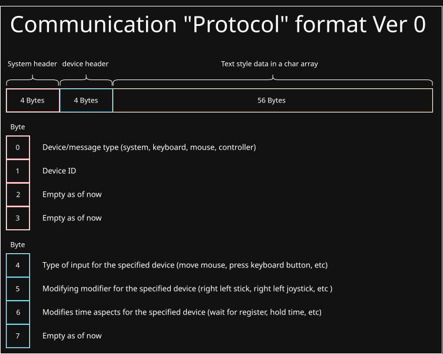

## Temporary Description
# Purpouse:
BackInput is a linux only "virtual device process" made using uinput on linux. It enables another app or a process to request to manage virtual devices and make them provide input to the host operating system. Can be used for something like user interaction in systems or even games. 
# How:
"Background process" that runs in background and after recieving a "formated" unix socket does what it is ordered to do.
## Visual representations:

## All of readme and codebase is subject to change project is major work in progress
## Some if not all of a protocol may be changed in a future to reduce or increase amount of data transfered
